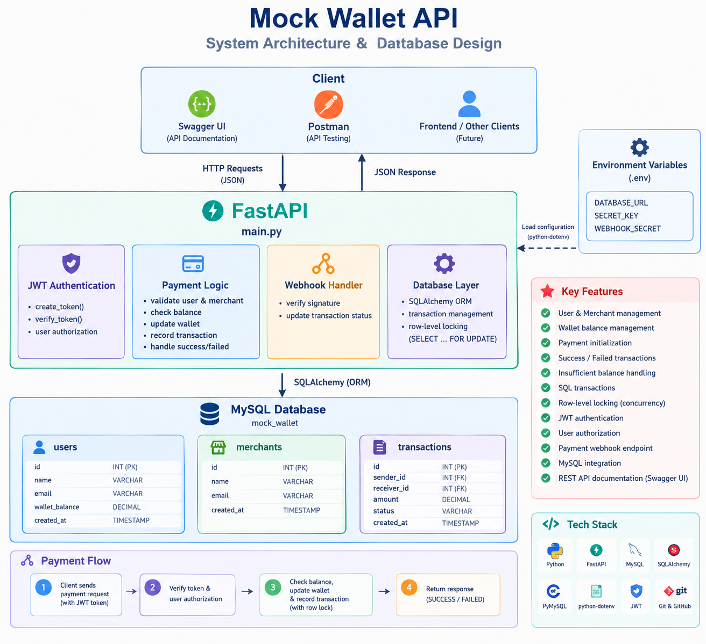

# Mock Wallet API

A backend REST API that simulates a digital wallet payment system using **Python, FastAPI, MySQL, and SQLAlchemy**.

The system allows authenticated users to make payments to merchants, validates wallet balances, records transactions, and safely handles concurrent payment requests.

## 🚀 Features

* User authentication using JWT
* User and merchant management
* Wallet balance management
* Payment initialization
* Successful and failed payment transactions
* Insufficient balance handling
* Transaction records stored in MySQL
* Database transactions using **commit and rollback**
* Row-level locking for concurrent payments
* User authorization
* Payment webhook endpoint
* Environment variables for sensitive configuration
* REST API documentation using Swagger UI
* Concurrency testing

## 🛠️ Technologies Used

| Technology   | Purpose                          |
| ------------ | -------------------------------- |
| Python       | Backend programming              |
| FastAPI      | REST API development             |
| SQLAlchemy   | Database ORM                     |
| MySQL        | Database                         |
| PyMySQL      | MySQL database connection        |
| JWT          | Authentication and authorization |
| Pydantic     | Request and response validation  |
| Uvicorn      | Running the FastAPI server       |
| Swagger UI   | API testing and documentation    |
| Git & GitHub | Version control                  |

## 📁 Project Structure

```text
mock-wallet-api/
│
├── main.py
├── database.py
├── models.py
├── auth.py
├── test_concurrency.py
├── requirements.txt
├── .gitignore
└── README.md
```

> The `.env` file is used for local configuration and should not be committed to GitHub.

## 🏗️ System Architecture



The system follows a simple backend architecture:

```text
Client
  ↓
FastAPI REST API
  ↓
Authentication & Validation
  ↓
Business Logic
  ↓
SQLAlchemy
  ↓
MySQL Database
```

## 🔄 How the Payment Flow Works

When a user makes a payment, the API follows these steps:

```text
User Login
    ↓
JWT Token
    ↓
Initialize Payment
    ↓
Verify User
    ↓
Verify Merchant
    ↓
Validate Payment Amount
    ↓
Check Wallet Balance
    ↓
Lock Wallet Row
    ↓
Process Payment
    ↓
Create Transaction Record
    ↓
Commit Transaction
```

If something goes wrong during the transaction:

```text
Payment Request
      ↓
Validation
      ↓
Error occurs
      ↓
ROLLBACK
      ↓
Database returns to previous state
```

This helps maintain consistency when handling financial transactions.

## 🔐 Authentication

The API uses **JWT (JSON Web Token)** for authentication.

### Authentication Flow

1. The user provides their login credentials.
2. The server verifies the credentials.
3. A JWT access token is generated.
4. The client sends the token with protected API requests.
5. The API verifies the token before processing the request.

Protected operations require a valid Bearer token.

## 💳 Payment Processing

The main payment API is:

### `POST /initialize-payment`

The payment process:

1. Verifies the authenticated user.
2. Checks whether the user exists.
3. Checks whether the merchant exists.
4. Validates the payment amount.
5. Checks the user's wallet balance.
6. Locks the wallet row before updating the balance.
7. Deducts the payment amount if sufficient balance is available.
8. Creates a transaction record.
9. Commits the database transaction.
10. Returns the payment status.

If the wallet does not have sufficient balance, the payment fails and the balance is not incorrectly reduced.

## 📡 API Endpoints

### `GET /`

Checks whether the API is running.

### `GET /users`

Returns the available users.

### `POST /login`

Authenticates a user and generates a JWT access token.

### `POST /initialize-payment`

Processes a payment from a user to a merchant.

### `POST /webhooks/payment`

Simulates receiving a payment status webhook from an external payment system.

## 🗄️ Database

The project uses **MySQL** as the database and **SQLAlchemy** as the ORM.

The main database tables are:

* `users`
* `merchants`
* `transactions`

### Users

Stores user information such as:

* User ID
* Name
* Email
* Wallet balance
* Account creation time

### Merchants

Stores merchant information such as:

* Merchant ID
* Name
* Email
* Creation time

### Transactions

Stores payment information such as:

* Transaction ID
* Sender
* Receiver
* Amount
* Transaction status
* Timestamp

## 🔄 Database Transactions

Database transactions are important because a payment may involve multiple database operations.

For example:

```text
Start Transaction
      ↓
Check Balance
      ↓
Deduct Money
      ↓
Create Transaction Record
      ↓
Everything Successful?
    ↙             ↘
  YES              NO
   ↓                ↓
COMMIT           ROLLBACK
```

### Commit

`commit()` permanently saves the changes made during the transaction.

### Rollback

`rollback()` cancels the changes made during the transaction if an error occurs.

This prevents situations where the wallet balance is changed but the transaction record is not correctly created.

## 🔒 Concurrency Handling

The payment API uses **row-level locking** with `SELECT ... FOR UPDATE`.

This prevents two simultaneous payment requests from incorrectly using the same wallet balance.

### Example

Suppose a user has **₹750** and two payment requests arrive at almost the same time:

```text
Initial Balance = ₹750

Request 1 → Pay ₹500
Request 2 → Pay ₹500
```

The database locks the wallet row while the first payment is being processed.

```text
Request 1
   ↓
Lock Wallet
   ↓
Check ₹750
   ↓
Deduct ₹500
   ↓
Balance = ₹250
   ↓
Commit
   ↓
Unlock
```

Then the second request checks the updated balance:

```text
Request 2
   ↓
Check Balance = ₹250
   ↓
₹250 < ₹500
   ↓
Payment Failed
```

Therefore, the same wallet balance cannot be incorrectly spent twice.

## 🪝 Payment Webhook

The project includes a payment webhook endpoint:

```text
POST /webhooks/payment
```

A webhook allows an external payment-related system to send payment status information to the backend.

The project uses a webhook secret to help verify incoming webhook requests.

## 🔒 Environment Variables

Sensitive configuration is stored in environment variables instead of being committed directly to the source code.

Example:

```env
DATABASE_URL=your_database_url
SECRET_KEY=your_secret_key
WEBHOOK_SECRET=your_webhook_secret
```

The `.env` file should **not** be uploaded to GitHub.

A `.env.example` file can be provided with placeholder values for other developers.

## 🧪 Testing

The API can be tested using:

* **FastAPI Swagger UI**
* **Postman**
* Concurrency testing using `test_concurrency.py`

After starting the server, open:

```text
http://127.0.0.1:8000/docs
```

FastAPI provides interactive API documentation where API requests can be sent and responses can be viewed.

## ⚙️ How to Run the Project

### 1. Clone the repository

```bash
git clone <your-github-repository-url>
```

### 2. Open the project

```bash
cd mock-wallet-api
```

### 3. Create a virtual environment

```bash
python -m venv venv
```

### 4. Activate the virtual environment

Windows:

```bash
venv\Scripts\activate
```

### 5. Install dependencies

```bash
pip install -r requirements.txt
```

### 6. Configure environment variables

Create a `.env` file:

```env
DATABASE_URL=your_database_url
SECRET_KEY=your_secret_key
WEBHOOK_SECRET=your_webhook_secret
```

### 7. Start the server

```bash
uvicorn main:app --reload
```

### 8. Open Swagger UI

```text
http://127.0.0.1:8000/docs
```

You can now test the API endpoints.

## 🧑‍💻 Example Payment Flow

A typical payment operation follows this sequence:

```text
Login
  ↓
Receive JWT Token
  ↓
Initialize Payment
  ↓
Authenticate User
  ↓
Validate Merchant
  ↓
Check Wallet Balance
  ↓
Lock Wallet
  ↓
Process Payment
  ↓
Create Transaction
  ↓
Commit
  ↓
Payment Successful
```

If the balance is insufficient:

```text
Initialize Payment
       ↓
Check Balance
       ↓
Insufficient Balance
       ↓
Payment Failed
       ↓
No Incorrect Balance Deduction
```

## 🛡️ Security Considerations

The project uses:

* JWT authentication
* User authorization
* Password protection
* Environment variables for secrets
* Webhook secret verification
* Balance validation
* Database transactions
* Row-level locking

Sensitive values such as passwords, JWT secrets, database credentials, and webhook secrets should never be committed to GitHub.

## 🔮 Future Improvements

Possible improvements include:

* Refresh token support
* Improved role-based authorization
* Transaction history API
* Pagination for transactions
* Improved error handling
* Payment status tracking
* Rate limiting
* Docker support
* Automated unit and integration tests
* Production database configuration

## 📌 Project Purpose

This project was built to understand how a backend payment system can be designed using **REST APIs, JWT authentication, MySQL, SQLAlchemy, database transactions, and concurrency control**.

The main focus is maintaining **data consistency and preventing incorrect wallet transactions**, especially when multiple payment requests occur at the same time.
